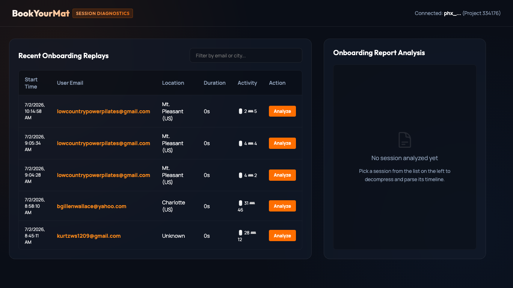

# PostHog Session Replay Analyzer & Diagnostics Dashboard



A set of lightweight, zero-dependency Node.js tools to download, decompress, parse, and analyze raw PostHog session recording snapshot replays (which are recorded using `rrweb` layout) into structured, readable user interaction timelines. 

It includes a beautiful, local, developer diagnostics dashboard interface to query recent sessions and perform AI-driven UX analysis in one click.

---

## Features
* **Automatic GZIP Decompression:** PostHog stores binary snapshots in GZIP blocks (`0x1f 0x8b`). This tool handles binary buffer extraction and decompressing using Node's native `zlib` module.
* **Batch Retrieval (Bypasses API Limits):** PostHog's Snapshot API restricts requests to at most 20 snapshot blobs in a single fetch. The downloader automatically chunks your recording fetch queries into batches and merges them.
* **High-Fidelity Parser:** Reconstructs the `rrweb` DOM actions. Extracts clean timelines tracking page views, clicks, text input values (omitting hidden characters/inputs), key API queries called, and React/console errors.
* **Diagnostics Dashboard:** A local-running developer portal served via a zero-dependency HTTP server (port 3099) styled with dark-mode glassmorphic aesthetics.
* **AI Report Synthesis:** If configured, the dashboard automatically pipes the parsed sequential log into Gemini (`gemini-2.5-flash`) or OpenAI's `gpt-4o-mini` to write a structured, senior-level UX onboarding analysis report in real-time. Gemini is used when `GEMINI_API_KEY` is set; otherwise it falls back to OpenAI, then to the raw timeline.

---

## Directory & File Breakdown

1. **`download-posthog-session.mjs`**  
   A CLI tool that connects to the PostHog API, queries the metadata and snapshot list, downloads the snapshot blobs in chunks, decompresses GZIP segments, and saves a unified, uncompressed JSON file.
   
2. **`parse-posthog-session.mjs`**  
   Reads the uncompressed session JSON, iterates over `rrweb` snapshot events, filters out static noise (like Facebook and Google trackers), and compiles a clean, sequential Markdown timeline.

3. **`session-analyzer-dashboard.mjs`**  
   A standalone Node server that exposes a diagnostics web portal. It retrieves the latest 200 recordings over the last 10 days, lets you search by email or location, and handles downloading, parsing, and OpenAI synthesis in a single click.

---

## Setup & Prerequisites

No external npm dependencies are required. All scripts run on **native Node.js (v18.17+)** using built-in modules (`http`, `zlib`, `fs`, `child_process`).

1. **Clone the repository:**
   ```bash
   git clone https://github.com/amirfish1/Posthog-session-analyzer.git
   cd Posthog-session-analyzer
   ```

2. **Add Environment Variables:**
   Create a `.env.local` file at the root of the project:
   ```env
   # PostHog personal API key (found under Account Settings > Personal API Keys)
   POSTHOG_PERSONAL_API_KEY=phx_your_posthog_personal_key
   
   # Optional: Gemini API Key for generating high-level AI onboarding reports.
   # Takes precedence over OPENAI_API_KEY when both are set.
   GEMINI_API_KEY=your_gemini_api_key
   
   # Optional: OpenAI API Key for generating high-level AI onboarding reports
   OPENAI_API_KEY=sk-proj-your_openai_api_key
   ```

---

## Usage

### 🚀 Running the Local Diagnostics Dashboard
To launch the interactive dashboard:
```bash
node session-analyzer-dashboard.mjs
```
Open **`http://localhost:3099`** in your browser. You can search, filter, and click **"Analyze"** on any session to download and render its rich Markdown report.

---

### 💻 Using the CLI Downloader
To download and parse a specific session directly from your terminal:
```bash
node download-posthog-session.mjs <session_recording_uuid> [output_directory]
```

* **Example:**
  ```bash
  node download-posthog-session.mjs 019f1f46-f22b-78b4-a9f5-3a505182331c ./reports
  ```
  This will fetch, decompress, and write:
  * `posthog-session-019f1f46-f22b-78b4-a9f5-3a505182331c.json` (uncompressed raw snapshots)
  * `posthog-session-019f1f46-f22b-78b4-a9f5-3a505182331c.timeline.md` (parsed raw log)
